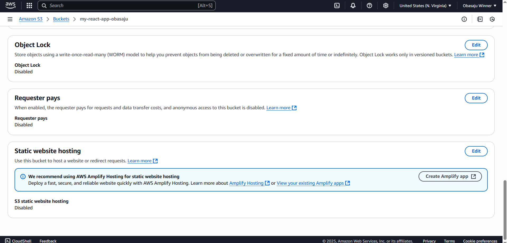
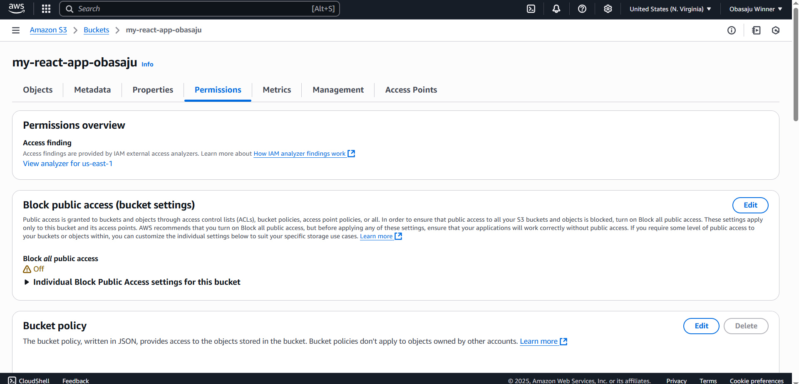
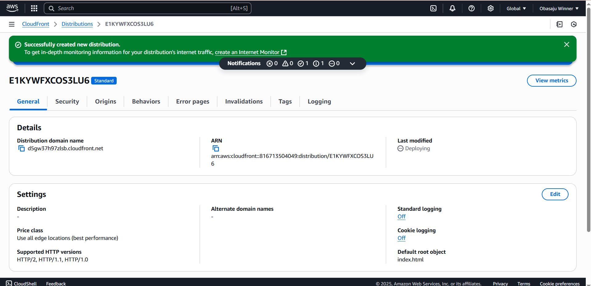

# react-aws-manual-deployment
Manual deployment of a react app to AWS S3 and CloudFront

# React App Manual Deployment to AWS

## 📌 Overview
This project demonstrates the manual deployment of a React app using the AWS Management Console.

## 🚀 Deployment Steps

1. **Built the React app locally:**
   ```bash
   npm run build

2. Created an S3 bucket configured for static website hosting.

3. Uploaded build files (/build) to the S3 bucket.

4. Configured CloudFront distribution pointing to the S3 static website endpoint.

[Public URL] (https://d5gw37h97zlsb.cloudfront.net)

| Service                     | Screenshot                                  |
| --------------------------- | ------------------------------------------- |
| S3 Bucket Properties        |            |
| CloudFront Distribution     |  |

🧾 Summary of Manual Steps
Built and uploaded a React app using the AWS Console.

Ensured the S3 bucket was publicly accessible.

Configured CloudFront to distribute the static site.              |


